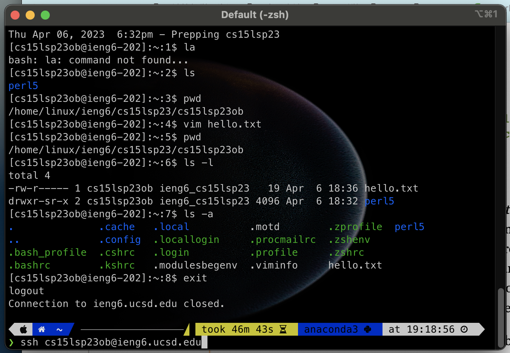
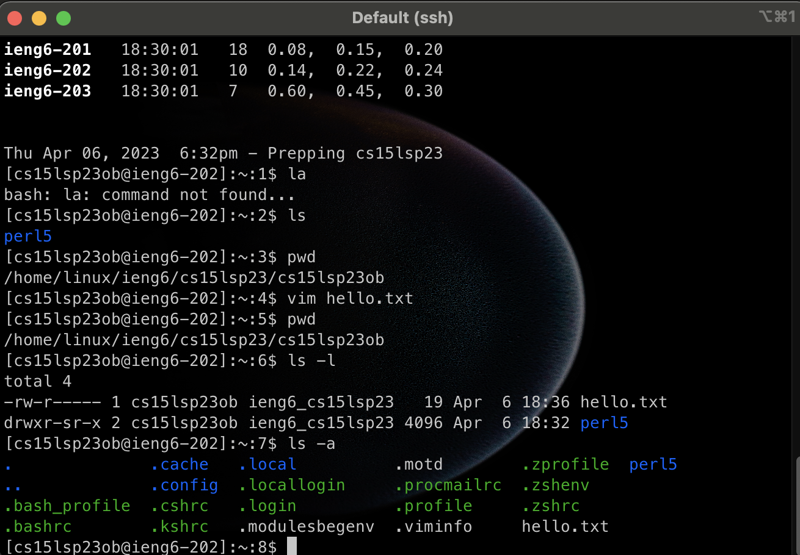

# I choose find as my command </br>
*  - name: this is an option to find a specific name or name patern. This is useful becuase you could use it as a filter to find the file with the keyword you want. I find this option using ChatGPT.</br>
example 1:
```
 find . -name "*.txt"
./chapter-13.4.txt
./chapter-13.5.txt
./chapter-13.1.txt
./chapter-13.2.txt
./chapter-13.3.txt
./chapter-3.txt
./chapter-2.txt
./chapter-1.txt
./chapter-5.txt
./chapter-6.txt
./chapter-7.txt
./chapter-9.txt
./chapter-8.txt
./preface.txt
./chapter-12.txt
./chapter-10.txt
./chapter-11.txt
```

example 2:
```
❯ find . -name "*1*.txt"
./chapter-13.4.txt
./chapter-13.5.txt
./chapter-13.1.txt
./chapter-13.2.txt
./chapter-13.3.txt
./chapter-1.txt
./chapter-12.txt
./chapter-10.txt
./chapter-11.txt
```

* - mtime <digit>:this is an option checking all the files that were modified with a period of time. It is important becuase we need to want some file that is just modified. I find this information from ChatGPT.
 
 example 1: 
```
❯ find . -mtime -7
❯ ls
chapter-1.txt    chapter-13.2.txt chapter-3.txt    chapter-9.txt
chapter-10.txt   chapter-13.3.txt chapter-5.txt    preface.txt
chapter-11.txt   chapter-13.4.txt chapter-6.txt
chapter-12.txt   chapter-13.5.txt chapter-7.txt
chapter-13.1.txt chapter-2.txt    chapter-8.txt
 
❯ vim chapter-1.txt
 
❯ ls -l
total 4432
-rwxr-xr-x@ 1 y  staff  118655  5  9 22:48 chapter-1.txt
-rwxr-xr-x@ 1 y  staff   47307  4 27 10:25 chapter-10.txt
-rwxr-xr-x@ 1 y  staff   71151  4 27 10:25 chapter-11.txt
-rwxr-xr-x@ 1 y  staff  127587  4 27 10:25 chapter-12.txt
-rwxr-xr-x@ 1 y  staff   89854  4 27 10:25 chapter-13.1.txt
-rwxr-xr-x@ 1 y  staff  110568  4 27 10:25 chapter-13.2.txt
-rwxr-xr-x@ 1 y  staff  150467  4 27 10:25 chapter-13.3.txt
-rwxr-xr-x@ 1 y  staff  265912  4 27 10:25 chapter-13.4.txt
-rwxr-xr-x@ 1 y  staff  290993  4 27 10:25 chapter-13.5.txt
-rwxr-xr-x@ 1 y  staff   79803  4 27 10:25 chapter-2.txt
-rwxr-xr-x@ 1 y  staff  264360  4 27 10:25 chapter-3.txt
-rwxr-xr-x@ 1 y  staff   99008  4 27 10:25 chapter-5.txt
-rwxr-xr-x@ 1 y  staff  149063  4 27 10:25 chapter-6.txt
-rwxr-xr-x@ 1 y  staff  128370  4 27 10:25 chapter-7.txt
-rwxr-xr-x@ 1 y  staff   84835  4 27 10:25 chapter-8.txt
-rwxr-xr-x@ 1 y  staff  149644  4 27 10:25 chapter-9.txt
-rwxr-xr-x@ 1 y  staff    9332  4 27 10:25 preface.txt
 
❯ find . -mtime -7
.
./chapter-1.txt
```
 
 


# Remotely Connecting


# Trying Some Commands
* ls is output the list of this current drictory
