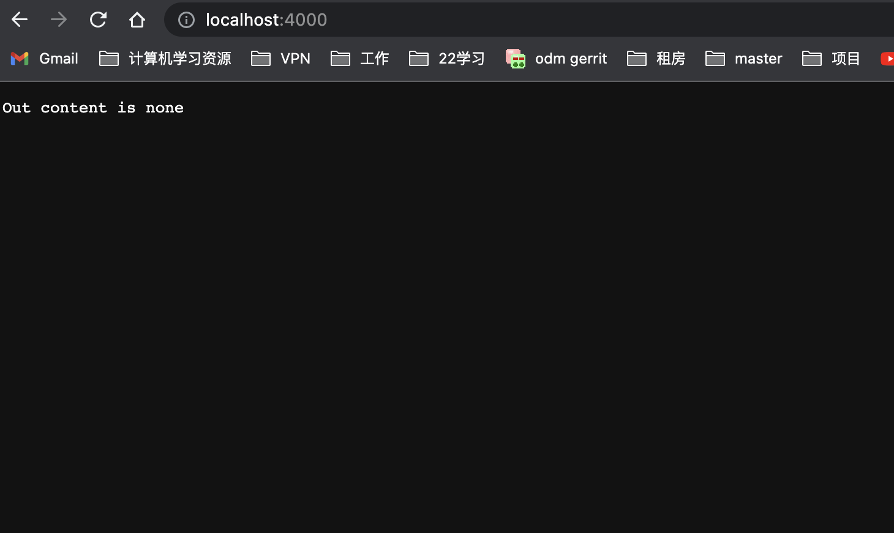
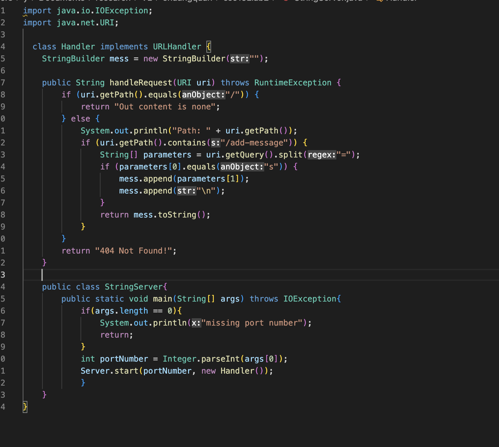

* Which methods in your code are called?<br />
compile the code
```
%javac StringServer.java
%java StringServer <Port Number>
```
access the website
```
http://localhost:<Port Number>
```

main method, server.start(),hanldeRequst()
  

* What are the relevant arguments to those methods, and the values of any relevant fields of the class?<br />
for main method it need a int input for port number.
for server.start, it needs portNumber and a new Handler.
for HandleRequest it needs a uri as a argument and Stringbuilder called mess.
