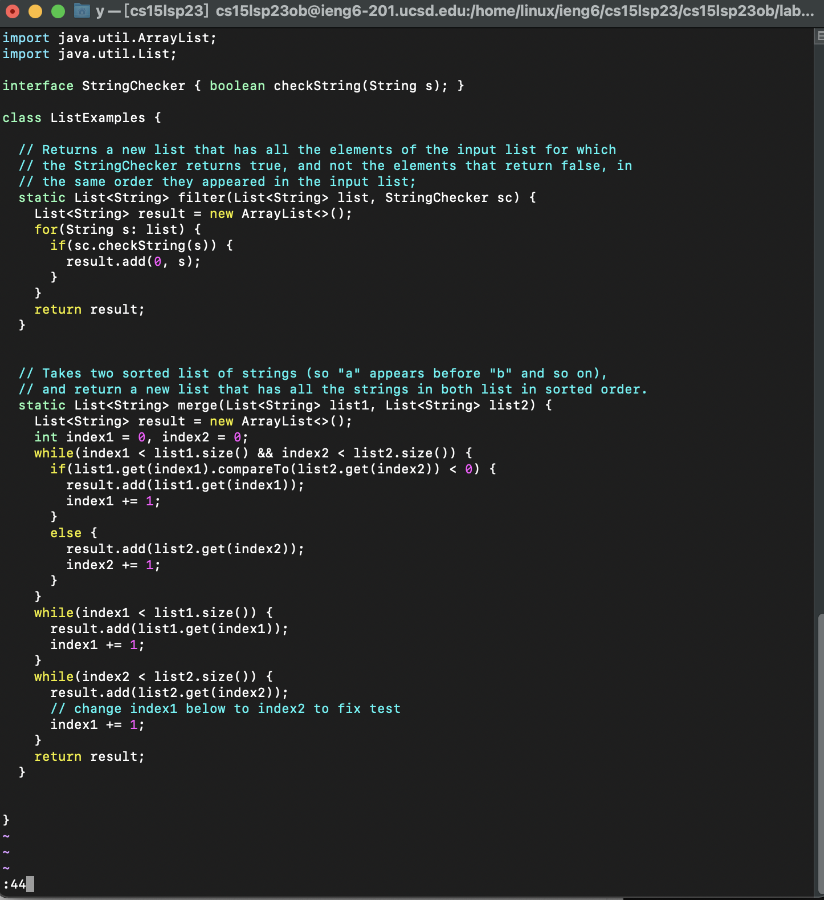
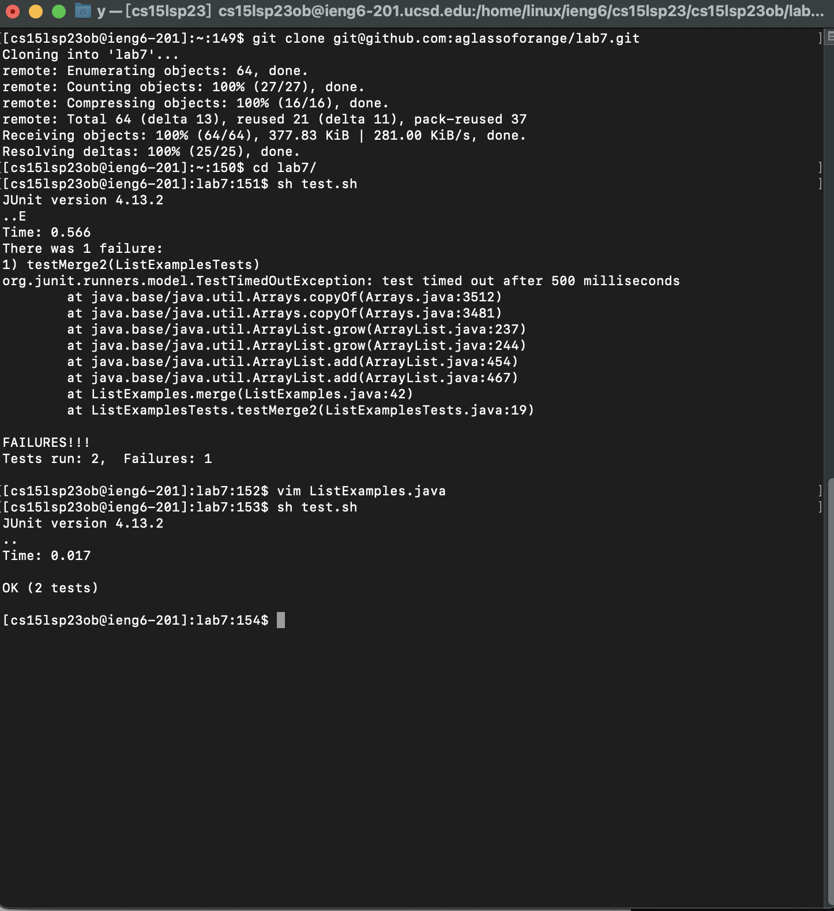
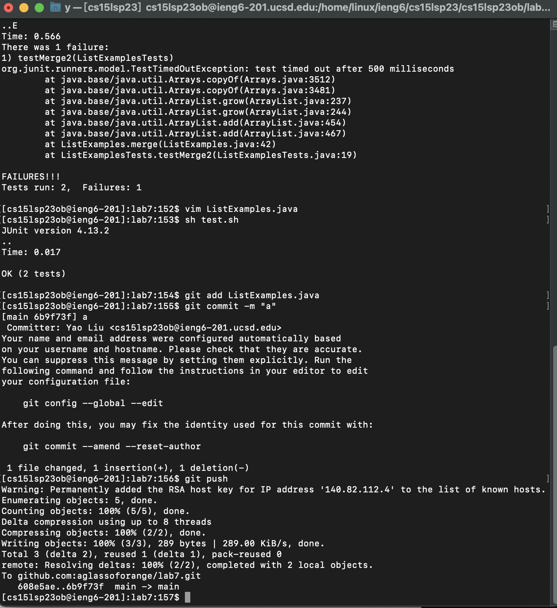

* Log into ieng6 <br />

```
Keys pressed: ssh<space>cs15lsp23ob@ieng6.ucsd.edu<enter>
```


* Clone your fork of the repository from your Github account<br />

```
go to github, and press ssh categroy and copy the link. SSH is better because I have set up SSH key during class, and I don't need to input the password.
Keys pressed: git clone git@github.com:aglassoforange/lab7.git<enter>
```


* Run the tests, demonstrating that they fail <br />

```
running the test script
Key pressed:sh test.sh<enter>
```



* change ListExamples.java's code

```
Key pressed:vim ListExamples.java<Enter> 
enter line 44：
<esc>:44 
get to character "1":
<right><right><right><right><right>
change "1" to "2":
r2
save file:
<esc>:wq <enter>
```

* retest the code:
```
runing the test script
Key pressed:sh test.sh<enter>
```


* update changes to github, I don't need to input the password:
```
Key pressed:git add ListExamples.java<enter>
```


