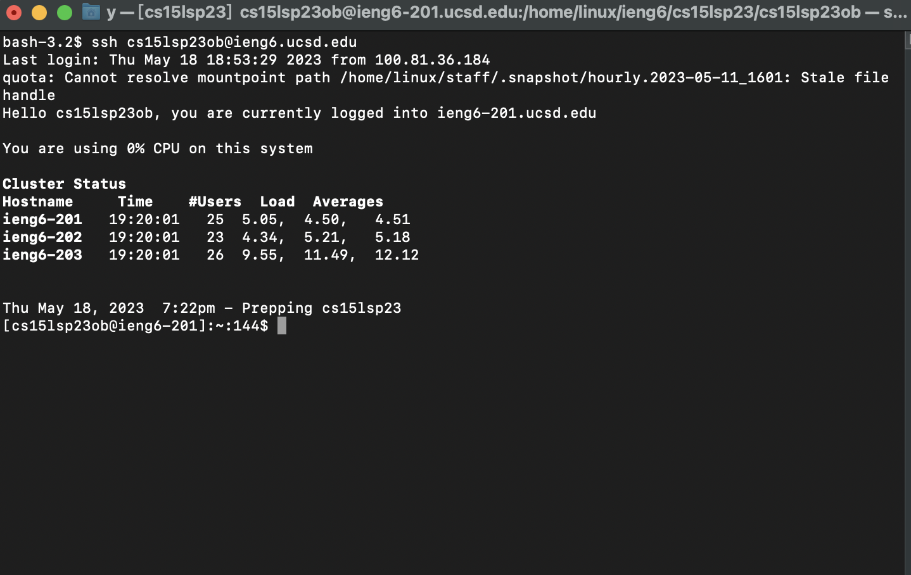
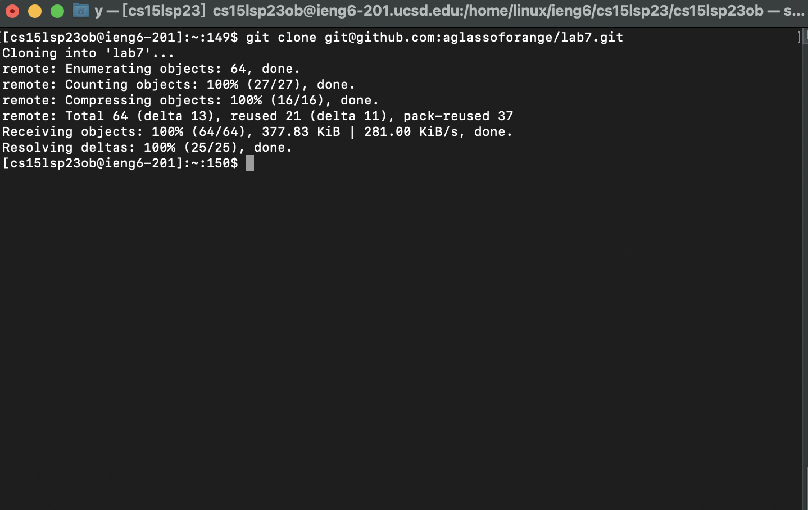
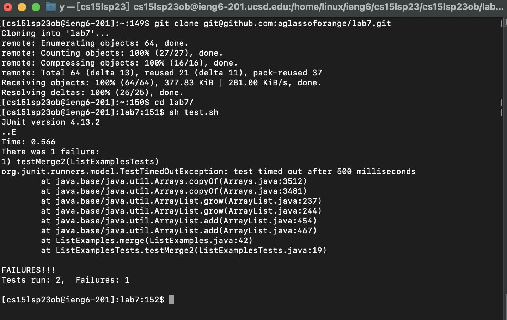

* Log into ieng6 <br />
```
Keys pressed: ssh<space>cs15lsp23ob@ieng6.ucsd.edu<enter>
```
```
Because we generated SSH keys for ieng6. 
```
```
We don't need to type the password to log in to the server.
```


* Clone your fork of the repository from your Github account<br />


go to github, and press ssh categroy and copy the link.
SSH is better because I have set up SSH key during class,
and I don't need to input the password.
Keys pressed: git clone git@github.com:aglassoforange/lab7.git<enter>




* Run the tests, demonstrating that they fail <br />

```
cd lab7<enter>: go to the driectory lab7.
running the test script
Key pressed:sh test.sh<enter>
```


