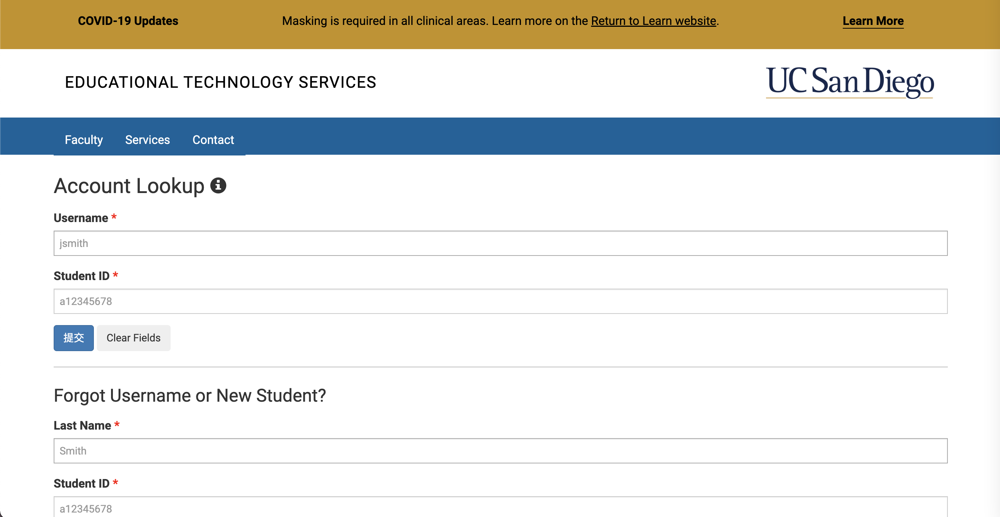

# Installing VScode

* connect to wifi and use your laptop
* Go to the Visual Studio Code website https://code.visualstudio.com/
* there are three vision and choose macOS becuase you use MacOs
* follow the prompt and install Vscode
* I try to write more steps yet I have been using vscode for a long time lol.

# Remotely Connecting

* the student account can be check online
* the link of the id is https://sdacs.ucsd.edu/~icc/index.php and the screenshot is provided above.
* student account should be 9 digit code
* I am using McOs, thus I don't need to set up anything. I just use my search bar to find terminal
* Open teriminal and use ssh to connect
* ssh **********@ieng6.ucsd.edu

# Trying Some Commands
* ls is output the list of this current drictory
* ls -l means to output more detailed info in this directory
* pwd  pwd command to find the path of your current working directory
* cp is copying the file to certain driectory

