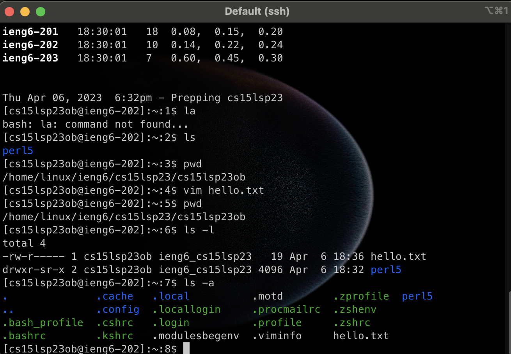

# Installing VScode

* connect to wifi and use your laptop
* Go to the Visual Studio Code website https://code.visualstudio.com/
* there are three vision and choose macOS becuase you use MacOs
* follow the prompt and install Vscode

# Remotely Connecting

* the student account can be check online
* student account should be 9 digit code
* Open teriminal and use ssh to connect
* ssh **********@ieng6.ucsd.edu

# Trying Some Commands
* ls is output the list of this current drictory
* pwd  pwd command to find the path of your current working directory
* cp is copying the file to certain driectory
