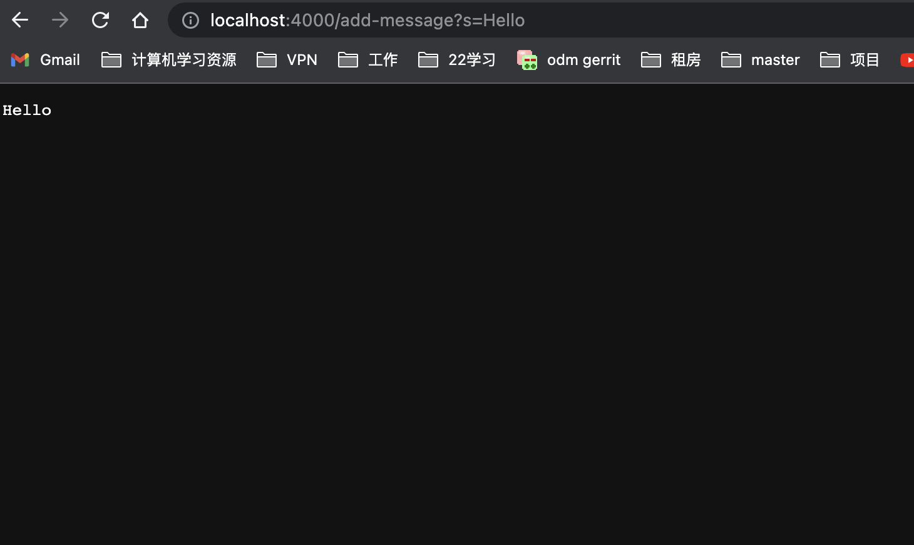
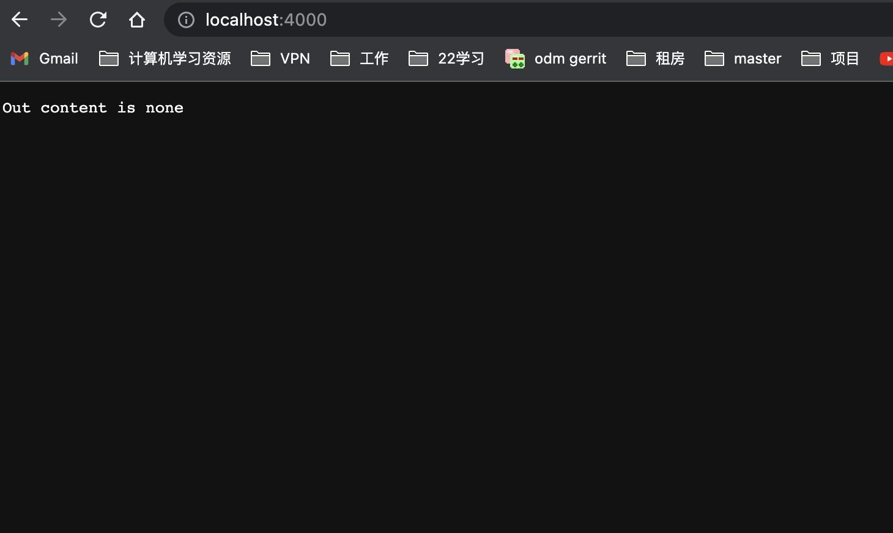

# Part 1

```
import java.io.IOException;
import java.net.URI;

  class Handler implements URLHandler {
    StringBuilder mess = new StringBuilder("");

    public String handleRequest(URI uri) throws RuntimeException {
        if (uri.getPath().equals("/")) {
            return "Out content is none";
        } else {
            System.out.println("Path: " + uri.getPath());
            if (uri.getPath().contains("/add-message")) {
                String[] parameters = uri.getQuery().split("=");
                if (parameters[0].equals("s")) {
                    mess.append(parameters[1]);
                    mess.append("\n");
                }
                return mess.toString();
            }
        }
        return "404 Not Found!";
    }
    
    public class StringServer{
        public static void main(String[] args) throws IOException{
            if(args.length == 0){
                System.out.println("missing port number");
                return;
            }
            int portNumber = Integer.parseInt(args[0]);
            Server.start(portNumber, new Handler());
            }
    }
}
```





* Which methods in your code are called?<br />
compile the code
```
%javac StringServer.java
%java StringServer <Port Number>
```
access the website
```
http://localhost:<Port Number>
```

main method, server.start(),hanldeRequst()
  

* What are the relevant arguments to those methods, and the values of any relevant fields of the class?<br />
for main method it need a int input for port number.
for server.start, it needs portNumber and a new Handler.
for HandleRequest it needs a uri as a argument and Stringbuilder called mess.

Correction(adding more details):
For this method called, the main method and the handleRequest in the Handler class are used.
The URL output  is
```
http://localhost:2530/add-message?s=My%Name%is%David
```
The string array, parameters are created when splitted with '='{s,My Name is David}. In this case the parameter[0] is "s" and parameter[1] is "My Name is David".
So the StringBuilder changed  and String "My Name is David" is appended which changes the StringBuilder becomes "My Name is David"

The URL output  is
```
http://localhost:2530/add-message?s=Apple
```
Calling second method, the main method and the handleRequest in the handler class are used. The URL output remains http://localhost:2530/add-message?s=Apple (from handleRequest method) from input, the string array, parameters are created when splitting with "=" as {s, Apple}. Thus, parameter[0] is "s" and parameter[1] is "Apple", so the stringBuilder append with "Apple".


* How do the values of any relevant fields of the class change from this specific request? If no values got changed, explain why.<br />
the value of stringbuilder is changed if the uri read from the browser has "/add-message?s" and it will add the string information after that.


# Part 2
```
static int[] reversed(int[] arr) { int[] newArray = new int[arr.length]; for(int i = 0; i < arr.length; i += 1) { arr[i] = newArray[arr.length - i - 1]; } return arr; }
```
This is the code<br />


*A failure-inducing input for the buggy program, as a JUnit test and any associated code (write it as a code block in Markdown)<br />
```
 @Test 
	public void testReverseInPlace() {
    int[] input1 = { 3 };
    ArrayExamples.reverseInPlace(input1);
    assertArrayEquals(new int[]{ 3 }, input1);
	}
```


As shown above it couldn't return the right value for the corssponding Junit test.


*An input that doesn’t induce a failure, as a JUnit test and any associated code (write it as a code block in Markdown)<br />
```
	@Test 
	public void testReverseInPlace() {
   int[] input1 = { };
   assertArrayEquals(new int[]{ }, ArrayExamples.reversed(input1));
}
```
This input won't trigger a error.


*The symptom, as the output of running the tests (provide it as a screenshot of running JUnit with at least the two inputs above)<br />


*The bug, as the before-and-after code change required to fix it (as two code blocks in Markdown)


Before:<br />
```
  static int[] reversed(int[] arr) {
    int[] newArray = new int[arr.length];
    for(int i = 0; i < arr.length; i += 1) {
      arr[i] = newArray[arr.length - i - 1];  
    return arr;
```

Correction: do it without creating new array
After:<br />

```
  static int[] reversed(int[] arr) {    
    int fast = 0;
    int end = arr.length - 1;
    
    while(fast < end){
    	int temp = arr[fast];
	arr[fast] = arr[end]; 
	arr[end] = temp;
      	fast +=1;
      	end -=1;
    }
   
    return arr;
    
```
Junit Test:<br />


The problem is that the value of arr[i] is being assigned tonewArray[arr.length - i - 1]. However, it is oppsite from what we want.


correction: adding more detail about the debugging process

The problem of the loop ius that it trying to return a new array with all the e elements of the input array in reversed order, but inside the loop, the value of arr[i] is being assigned to newArray[arr.length - i - 1]. It should be the other way around.
By fixing it, I just trying to use a singe array to accomplish what we need to do, changing the first index with the last index and so on.

# Part 3 

From the past CSE15L class, I learned alot of things from how to build a simple server and interact with it from browser. I don't know that we could actually start the server by only using  Java excluding from the certian framework.

